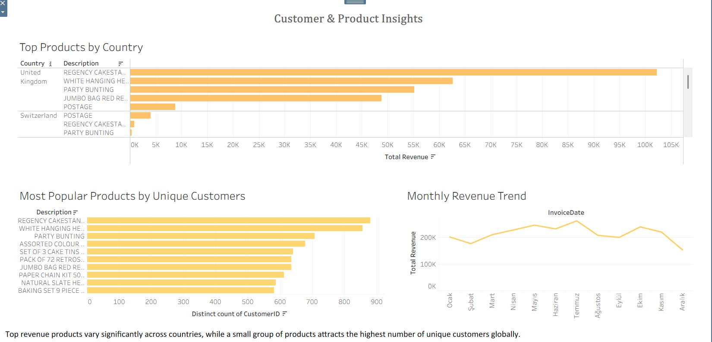
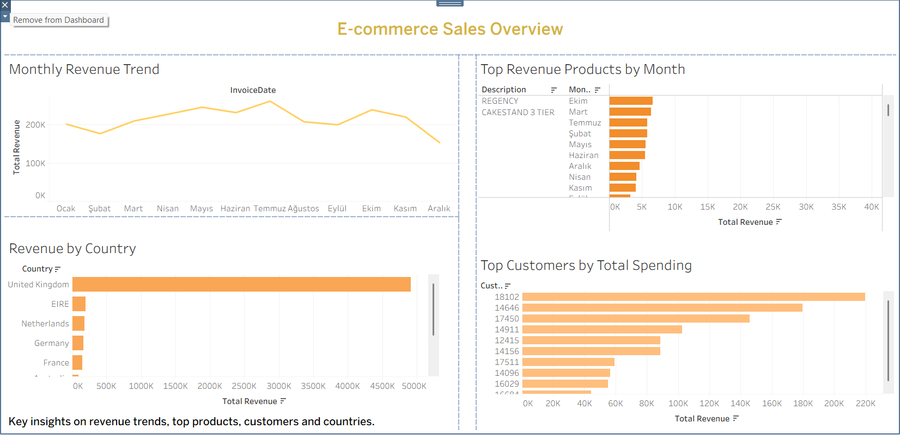

# E-Commerce Customer Behavior Analysis

An end-to-end e-commerce data analysis project using SQL, Google Sheets, and Tableau dashboards.

## 📌 Project Overview

This project analyzes customer purchasing behavior and sales performance using the Online Retail dataset from Kaggle.

The objective is to identify:
- Revenue trends over time
- Best-performing products
- High-value customers
- Country-level sales distribution
- Product popularity vs revenue concentration

Dataset:
https://www.kaggle.com/datasets/carrie1/ecommerce-data

---
## 🎯 Business Questions

This analysis aims to answer the following business questions:

- Which products generate the highest revenue?
- Which products are most popular among customers?
- Are revenue-generating products also the most frequently purchased?
- Which countries contribute most to total revenue?
- How does monthly revenue fluctuate over time?
- Who are the highest-value customers?
  
---

## 🧹 Data Cleaning (Google Sheets)

The dataset was cleaned by:
- Removing canceled transactions
- Removing null prices
- Checking for missing customer IDs
- Validating quantity values

Pivot tables were created to analyze:
- Best-selling products
- Monthly sales trends
- Average order value per customer

---

## 🗄 SQL Analysis

The following SQL analyses were performed:

- Customer total spending  
  `SUM(Quantity * UnitPrice)`

- Top 10 revenue-generating products  
  `ORDER BY total_revenue DESC LIMIT 10`

- Revenue grouped by country and date

All SQL queries are available in the SQL folder.

---

## 📊 Tableau Dashboards

Two dashboards were created as part of this project:

### 1️⃣ E-commerce Sales Overview (Group Work)
This dashboard includes:
- Monthly Revenue Trend
- Top Revenue Products
- Revenue by Country
- Top Customers by Total Spending

🔗 View Dashboard:
https://public.tableau.com/views/E-CommerceSalesOverview_17714701945290/E-commerceSalesOverview?:language=en-US&:sid=&:redirect=auth&:display_count=n&:origin=viz_share_link

---

### 2️⃣ Customer & Product Insights (Portfolio Extension)
This extended dashboard includes:
- Top Revenue Products by Country
- Most Popular Products by Unique Customers
- Country-level product comparison
- Revenue vs Popularity behavioral insights

🔗 View Dashboard:
https://public.tableau.com/views/CustomerProductInsights/CustomerProductInsights?:language=en-US&publish=yes&:sid=&:redirect=auth&:display_count=n&:origin=viz_share_link

---

## 🔍 Key Insights

- Revenue is heavily concentrated in a small number of countries.
- The United Kingdom contributes the majority of total revenue.
- Some high-revenue products are not necessarily the most popular by unique customer count.
- Product popularity and revenue generation follow different behavioral patterns.
- Seasonal trends indicate fluctuations in mid-year and year-end performance.

